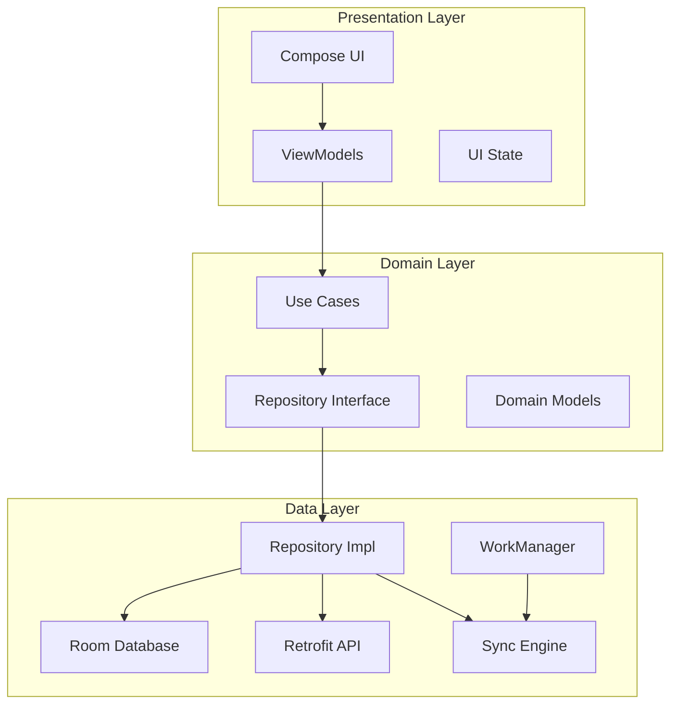

# Design Document

## Overview

The offline-first task management system is built using Clean Architecture principles with MVVM pattern for Android. The system provides seamless task management capabilities that work both online and offline, with automatic synchronization when connectivity is restored. The architecture ensures separation of concerns, testability, and maintainability while delivering a responsive user experience.

## Architecture

The system follows Clean Architecture with three main layers:

### Presentation Layer
- **UI Components**: Jetpack Compose screens and components
- **ViewModels**: Manage UI state and handle user interactions
- **UI State**: Immutable data classes representing screen states

### Domain Layer
- **Use Cases**: Business logic operations (CreateTask, UpdateTask, DeleteTask, SyncTasks)
- **Repository Interfaces**: Abstract data access contracts
- **Domain Models**: Core business entities (Task, SyncStatus)

### Data Layer
- **Repository Implementations**: Coordinate between local and remote data sources
- **Local Data Source**: Room database operations
- **Remote Data Source**: REST API operations via Retrofit
- **Sync Engine**: Handles offline/online synchronization logic



## Components and Interfaces

### Core Domain Models

```kotlin
data class Task(
    val id: String,
    val description: String,
    val isCompleted: Boolean,
    val createdAt: Long,
    val updatedAt: Long,
    val syncStatus: SyncStatus
)

enum class SyncStatus {
    SYNCED,           // In sync with remote
    PENDING_CREATE,   // Created locally, needs upload
    PENDING_UPDATE,   // Modified locally, needs sync
    PENDING_DELETE    // Deleted locally, needs remote deletion
}
```

### Repository Interface

```kotlin
interface TaskRepository {
    fun getAllTasks(): Flow<List<Task>>
    suspend fun createTask(description: String): Result<Task>
    suspend fun updateTask(task: Task): Result<Task>
    suspend fun deleteTask(taskId: String): Result<Unit>
    suspend fun syncWithRemote(): Result<Unit>
}
```

### Use Cases

```kotlin
class CreateTaskUseCase(private val repository: TaskRepository) {
    suspend operator fun invoke(description: String): Result<Task>
}

class UpdateTaskUseCase(private val repository: TaskRepository) {
    suspend operator fun invoke(task: Task): Result<Task>
}

class DeleteTaskUseCase(private val repository: TaskRepository) {
    suspend operator fun invoke(taskId: String): Result<Unit>
}

class SyncTasksUseCase(private val repository: TaskRepository) {
    suspend operator fun invoke(): Result<Unit>
}
```

### Network Monitor

```kotlin
interface NetworkMonitor {
    val isOnline: Flow<Boolean>
}
```

## Data Models

### Room Database Entities

```kotlin
@Entity(tableName = "tasks")
data class TaskEntity(
    @PrimaryKey val id: String,
    val description: String,
    val isCompleted: Boolean,
    val createdAt: Long,
    val updatedAt: Long,
    val syncStatus: String
)

@Dao
interface TaskDao {
    @Query("SELECT * FROM tasks ORDER BY createdAt DESC")
    fun getAllTasks(): Flow<List<TaskEntity>>
    
    @Insert(onConflict = OnConflictStrategy.REPLACE)
    suspend fun insertTask(task: TaskEntity)
    
    @Update
    suspend fun updateTask(task: TaskEntity)
    
    @Delete
    suspend fun deleteTask(task: TaskEntity)
    
    @Query("SELECT * FROM tasks WHERE syncStatus != 'SYNCED'")
    suspend fun getPendingSyncTasks(): List<TaskEntity>
}
```

### API Data Transfer Objects

```kotlin
data class TaskDto(
    val id: String,
    val description: String,
    val isCompleted: Boolean,
    val createdAt: Long,
    val updatedAt: Long
)

interface TaskApiService {
    @GET("tasks")
    suspend fun getAllTasks(): Response<List<TaskDto>>
    
    @POST("tasks")
    suspend fun createTask(@Body task: TaskDto): Response<TaskDto>
    
    @PUT("tasks/{id}")
    suspend fun updateTask(@Path("id") id: String, @Body task: TaskDto): Response<TaskDto>
    
    @DELETE("tasks/{id}")
    suspend fun deleteTask(@Path("id") id: String): Response<Unit>
}
```

## Correctness Properties

*A property is a characteristic or behavior that should hold true across all valid executions of a system-essentially, a formal statement about what the system should do. Properties serve as the bridge between human-readable specifications and machine-verifiable correctness guarantees.*

### Property 1: Task Operations Persistence
*For any* valid task operation (create, update, delete, toggle completion), the operation should be immediately persisted in local storage and marked with appropriate sync status based on connectivity
**Validates: Requirements 1.1, 1.2, 2.1, 3.1, 4.1**

### Property 2: Offline Operation Consistency  
*For any* task operation performed while offline, the operation should be stored locally with PENDING sync status and automatically synchronized when connectivity is restored
**Validates: Requirements 5.1, 5.2, 5.3**

### Property 3: Sync Engine Completeness
*For any* set of pending changes, synchronization should process all operations (create, update, delete) and update sync statuses to SYNCED upon successful completion
**Validates: Requirements 6.1, 6.2, 6.5**

### Property 4: Conflict Resolution Consistency
*For any* sync conflict between local and remote data, the system should resolve using last-write-wins strategy based on timestamps
**Validates: Requirements 6.3**

### Property 5: Error Handling and Recovery
*For any* failed operation (validation, network, database), the system should revert to previous state, display appropriate error feedback, and maintain data integrity
**Validates: Requirements 1.4, 2.4, 3.4, 4.4**

### Property 6: Background Sync Reliability
*For any* pending changes when app is backgrounded, WorkManager should schedule and execute synchronization tasks with proper retry logic on failures
**Validates: Requirements 7.1, 7.2, 7.4**

### Property 7: Data Validation Consistency
*For any* task input that is empty or contains only whitespace characters, the system should reject the operation and maintain current state
**Validates: Requirements 1.5**

### Property 8: Timestamp Management
*For any* task update operation, the system should preserve the original creation timestamp while updating the modification timestamp
**Validates: Requirements 2.5, 4.5**

### Property 9: Threading Safety
*For any* network operation, the system should execute on background threads and maintain UI responsiveness without blocking the main thread
**Validates: Requirements 8.3**

## Error Handling

### Network Errors
- **Connection Timeout**: Retry with exponential backoff, fallback to local operations
- **Server Errors (5xx)**: Queue operations for later retry, continue with local data
- **Client Errors (4xx)**: Log error, notify user, do not retry automatically

### Database Errors
- **Constraint Violations**: Validate data before insertion, provide user feedback
- **Disk Space**: Implement cleanup strategies, notify user of storage issues
- **Corruption**: Implement database recovery mechanisms

### Synchronization Conflicts
- **Last Write Wins**: Use timestamp-based conflict resolution
- **Merge Strategies**: For non-conflicting changes, merge updates
- **User Resolution**: For critical conflicts, prompt user for resolution

### Validation Errors
- **Empty Descriptions**: Prevent task creation, show validation message
- **Invalid IDs**: Generate new UUIDs, log inconsistencies
- **Malformed Data**: Sanitize input, provide error feedback

## Testing Strategy

### Unit Testing Framework
- **JUnit 5**: Primary testing framework for business logic
- **MockK**: Mocking framework for Kotlin
- **Turbine**: Testing Flow emissions
- **Coroutines Test**: Testing coroutine-based code

### Property-Based Testing
- **Kotest Property Testing**: Generate random test inputs for comprehensive validation
- **Minimum 100 iterations** per property test to ensure statistical confidence
- Each property test tagged with format: **Feature: offline-task-sync, Property {number}: {property_text}**

### Unit Tests Coverage
- **Use Cases**: Test all business logic scenarios including error cases
- **Repository**: Test data coordination between local and remote sources  
- **ViewModels**: Test state management and user interaction handling
- **Sync Engine**: Test synchronization logic and conflict resolution

### Integration Tests
- **Database Operations**: Test Room database interactions with real SQLite
- **API Integration**: Test Retrofit service with mock server responses
- **End-to-End Sync**: Test complete offline-to-online synchronization flows

### UI Tests
- **Compose Testing**: Test UI components and user interactions
- **Espresso**: Test complete user workflows and navigation
- **Screenshot Testing**: Ensure UI consistency across different states

### Testing Approach
- **Implementation-First Development**: Implement features before writing corresponding tests
- **Dual Testing Strategy**: Combine unit tests for specific scenarios with property tests for universal behaviors
- **Test Isolation**: Each test should be independent and not rely on external state
- **Realistic Data**: Use actual data structures rather than mocks where possible for integration tests